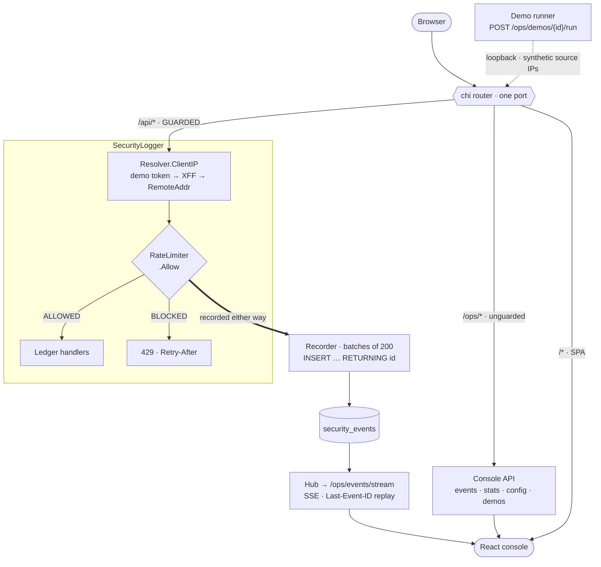

# Go-Ledger

**[Try the console](https://mariaalexissales.github.io/Go-Ledger/)** _(a recording, see
[GitHub Pages](#github-page-preview))_

A small double-entry-ish ledger API in Go, wrapped in an IP rate limiter and a
security logger. It comes with a React console that makes the logger visible and a
set of demo scenarios that attack it on demand.

The ledger is the excuse. The interesting part is `internal/ops`. Every request is
evaluated by a rate limiter and recorded as `ALLOWED` or `BLOCKED`, and the console
lets you watch that happen live while scripted traffic patterns try to get past it.



The guard is `/api` only, and the console watching it is not behind the guard. Both
halves are detailed in [How the security logger works](#how-the-security-logger-works).

> **This project contains a deliberate vulnerability.** The default client-IP
> resolver trusts the `X-Forwarded-For` header verbatim, which makes the rate
> limiter trivially bypassable. That is the point of the `xff-spoof` demo. You can
> toggle it off in the UI and re-run to see the difference. Do not copy
> `internal/ops/clientip.go` into anything real without reading the note in it.

---

## Quickstart

### Everything in one command

```bash
docker compose up --build
```

Then open <http://localhost:8080>. Postgres comes up first, gated on a healthcheck.
Migrations run, 50 accounts and 200 transactions are seeded, and the Go binary serves
both the API and the console on a single port, so no CORS is involved at all.

> **First run after upgrading:** the compose file now mounts the Postgres volume at
> `/var/lib/postgresql/data` instead of the parent directory. If you have an older
> `pgdata` volume, Postgres will refuse to start on it. Run `docker compose down -v`
> once to discard it. The data is regenerated seed data, and `SEED_ON_START=true`
> refills it on the next boot.

### Development with hot reload

```bash
npm run db:up
```

Then the API and the console in two terminals:

```bash
npm run dev:api
```

```bash
npm run dev:web
```

That puts the Go API on `:8080` and Vite on `:5173`. Open <http://localhost:5173>.
Vite proxies `/api` and `/ops` to the Go server, so the app behaves identically to the
container build while keeping HMR.

Two terminals rather than one script: running both processes from a single npm script
needs a dependency, and PowerShell has no portable way to background one. Nothing here
needs `npm install` — the root `package.json` is a task runner with no dependencies of
its own.

Copy `.env.example` to `.env` first if you want to change anything. A missing `.env`
is not fatal, and real environment variables always win.

Other scripts: `npm run seed`, `npm run reset`, `npm run build`, `npm run fmt`,
`npm run typecheck`, `npm test`, `npm run test:race`, `npm run db:down`, `npm run down`.

`npm run lint` needs [golangci-lint](https://golangci-lint.run) on your PATH:

```bash
go install github.com/golangci/golangci-lint/v2/cmd/golangci-lint@latest
```

CI runs the same config, plus `go test ./... -race`. The race detector needs cgo,
so it will not run locally without a C compiler — that is the one check only CI
performs.

---

## How the security logger works

Every request to `/api` passes through `SecurityLogger`
([internal/ops/middleware.go](internal/ops/middleware.go)):

1. **Resolve the source IP** using the configured `CLIENT_IP_MODE`.
2. **Ask the rate limiter** whether that IP is over its budget.
3. **Record the decision** as a `security_events` row, always, allowed or blocked.
4. **Refuse with 429** (JSON, plus `Retry-After` and `X-RateLimit-*`) if blocked.

### The router is split in two, on purpose

```
/health          unguarded   container healthcheck
/api/*           GUARDED     the ledger: accounts, transactions
/ops/*           unguarded   the console watching the guard
/*               unguarded   the React app (embedded SPA, history fallback)
```

The guard protects the ledger, and the console is the instrument observing it. If the
console were guarded too, the dashboard would rate-limit itself within seconds and
flood the event log with its own reads, burying the traffic it exists to display.
This also means the only rows in `security_events` are real ledger traffic, which is
what makes a demo run legible.

The tradeoff is that **`/ops` has no authentication.** It is fine for a local demo and
unacceptable anywhere else. Set `OPS_ENABLED=false` and `DEMOS_ENABLED=false` before
deploying this anywhere reachable.

### Events reach the browser without polling

Writing an audit row per request used to be a fire-and-forget goroutine, each taking
its own pool connection. A burst demo exhausts that pool and silently drops the
events the demo is meant to show. It now goes through a batching recorder
([internal/ops/recorder.go](internal/ops/recorder.go)): one worker, a bounded queue,
inserts of up to 200 rows at a time, published to subscribers only _after_ the insert
so every streamed event carries a real database id. That id is what lets the browser
reconnect with `Last-Event-ID` and have the gap replayed instead of lost.

---

## Demo scenarios

Open **Demos** in the console. Each card fires a scripted traffic pattern at the API
from the server itself, using synthetic source IPs from the RFC 5737 documentation
ranges, so your own browser is never rate-limited by a run.

| Scenario       | What it does                                            | What it proves                                                                                    |
| -------------- | ------------------------------------------------------- | ------------------------------------------------------------------------------------------------- |
| `baseline`     | 4 clients, 3 requests each, at a human pace             | What a healthy log looks like. Read the rest against it.                                          |
| `burst`        | One IP, `limit × 2 + 5` requests back to back           | The case the limiter is built for: refused after the limit, with a `Retry-After` countdown.       |
| `low-and-slow` | 20 clients, 6 requests each — 120 in total, none near the limit | **More total traffic than `burst`, and zero blocks.** Per-IP limiting cannot see distributed load. |
| `xff-spoof`    | One machine, a new forged `X-Forwarded-For` per request | **Zero blocks.** The guard believes the header, so the attacker gets a fresh identity every time.  |
| `enumeration`  | Sequential `GET /api/accounts/{1..N}` from one IP       | Volume gets blocked, but the shape (ordered IDs, a trail of 404s) is what a log is for.            |

The two that show the guard failing are the more useful ones.

### The before and after

Flip **Trust X-Forwarded-For** off on the demos page and run `xff-spoof` again. The
same 90 requests go from 0 blocked to 60 blocked, because the guard now uses the
socket peer instead of a header the client controls.

Scenarios other than `xff-spoof` keep working in both modes. They claim their
identity over a separate token-gated channel: `X-Demo-Client-IP`, honored only for a
loopback caller presenting a token generated in memory at startup. Only the spoof
scenario uses the untrusted header, because testing whether the server believes it is
the entire point.

### Adding your own

One entry in the `scenarios` slice in
[internal/demo/scenarios.go](internal/demo/scenarios.go). Nothing else needs wiring. It
shows up in the API listing and the UI automatically.

```go
var scenarios = []Scenario{
    // ...
    {
        Meta: Meta{
            ID:      "my-scenario",
            Name:    "My scenario",
            Summary: "One line for the card.",
            Teaches: "What this reveals about the guard.",
            Expect:  "What the operator should watch for.",
            Tags:    []string{"rate limiting"},
        },
        Run: func(ctx context.Context, c *Client) error {
            limit := c.Policy().Limit // scale to whatever is configured
            c.Note("Starting")

            for range limit * 2 {
                if _, err := c.Get(ctx, As("203.0.113.9"), "/api/accounts/1"); err != nil {
                    return err
                }
            }
            return nil
        },
    },
}
```

Scale request counts off `c.Policy().Limit` rather than hardcoding them, as every
existing scenario does. A scenario written for a limit of 30 demonstrates nothing once
somebody tunes the limit to 5 in the console.

`As(ip)` claims an identity over the trusted channel. `Spoof(ip)` sends a raw
`X-Forwarded-For`. Runs are capped at 400 requests and 90 seconds, one at a time.

**After changing a scenario, re-record the public demo** or the Pages build keeps
replaying the old behavior. The easiest way is Actions → **Record demo data** →
_Run workflow_. See [Regenerating the demo data](#regenerating-the-demo-data).

---

## GitHub Page Preview

GitHub Pages serves static files only. No Go process, no Postgres, no SSE, no demo
runner. So the published console runs in **replay mode**. `cmd/record` drives your
real local server, captures each scenario's genuine run output along with the
`security_events` rows it produced, and writes them to `web/public/replay/`. The
static build replays those recordings at a watchable speed.

Recording rather than simulating means there is no second implementation of the rate
limiter to drift away from the Go one. The numbers on the public demo are the numbers
the real guard produced. Both client-IP modes are recorded, so the vulnerable and
hardened toggle still works, and that is the most instructive part.

Two things are degraded, and the banner says so on every page. Ledger edits live in
the browser tab and vanish on reload, and the limiter policy is fixed at recording
time.

**One-time setup:** in the repo settings, set **Pages → Source → GitHub Actions**. The
workflow cannot do this for you. After that,
[.github/workflows/pages.yml](.github/workflows/pages.yml) builds and deploys on every
push to `main`.

### Regenerating the demo data

Press the button: **Actions → Record demo data → Run workflow**.

[.github/workflows/record.yml](.github/workflows/record.yml) stands up Postgres, builds
and boots the API, seeds the ledger, runs all five scenarios in both client-IP modes,
commits the fresh fixtures back to `main`, and redeploys Pages. Nothing to install
locally. Two inputs:

- **fake_seed** seeds the fake ledger. The same value always produces the same 50
  accounts, so leave it alone unless you deliberately want different names.
- **deploy** can be unticked to record and commit without publishing.

**Re-running with no code changes produces no commit.** Every run measures slightly
different millisecond timings over loopback, so the recorder compares against the
committed fixture ignoring timestamps and durations, and leaves the file alone when
nothing meaningful changed. Change a scenario and the affected fixtures update. Change
nothing and the workflow reports "nothing to do". Those timings stay in the committed
files, since they drive the replay pacing and they are real measurements. They just do
not count as a change.

To record and preview locally instead:

```bash
npm run record
```

```bash
npm run build:pages
```

```bash
npm run preview:pages
```

That serves the static bundle at <http://localhost:4173/Go-Ledger/> with no backend
running at all, which is the real test. Stop the Go server before checking. The path
comes from `VITE_BASE` in `web/.env.pages` and must match the repository name, since
that is what GitHub Pages puts in front of every asset URL.

A deep link like `/Go-Ledger/demos` answers with an HTTP 404 status even though the
page renders correctly. That is unavoidable on Pages, which has no history fallback:
the build copies `index.html` to `404.html`, Pages serves that for any unknown path,
and the SPA boots and routes on the real URL. Only the status line is wrong.

Moving to a user page or a custom domain? Change `VITE_BASE` in
[web/.env.pages](web/.env.pages) to `/`. The router base path and fixture URLs both
derive from it.

---

## API

Lists share one envelope: `{"data": [...], "total": N, "limit": N, "offset": N}`.
Errors are always `{"error": "..."}`.

### Ledger: `/api`, rate limited

| Method | Path                              | Notes                                 |
| ------ | --------------------------------- | ------------------------------------- |
| GET    | `/api/accounts`                   | `limit`, `offset`, `q` (name search)  |
| POST   | `/api/accounts`                   | `{"name": "..."}`                     |
| GET    | `/api/accounts/{id}`              |                                       |
| DELETE | `/api/accounts/{id}`              | Cascades to its transactions          |
| GET    | `/api/accounts/{id}/transactions` | `limit`, `offset`                     |
| GET    | `/api/transactions`               | `limit`, `offset`, `account_id`       |
| POST   | `/api/transactions`               | `{"account_id": 1, "amount": 100.50}` |
| GET    | `/api/transactions/{id}`          |                                       |
| DELETE | `/api/transactions/{id}`          |                                       |

`amount` and `balance` are JSON **numbers**, not strings. `pgtype.Numeric` hands the
raw bytes to the Postgres numeric parser, so `"100.50"` is rejected as an invalid body.

### Console: `/ops`, not rate limited, no auth

| Method | Path                         | Notes                                                                                   |
| ------ | ---------------------------- | --------------------------------------------------------------------------------------- |
| GET    | `/ops/config`                | Active IP mode, limiter policy, and how the guard sees _you_                            |
| GET    | `/ops/events`                | `flag_status`, `ip_address` (comma-separated), `action_type`, `since`, `limit`, `offset` |
| GET    | `/ops/events/stream`         | SSE, honors `Last-Event-ID`, heartbeats every 15s                                       |
| GET    | `/ops/stats`                 | `window`, totals, top IPs, per-minute buckets, currently-blocked IPs                    |
| GET    | `/ops/demos`                 | Scenario registry                                                                       |
| POST   | `/ops/demos/{id}/run`        | Returns the full step list and a verdict                                                |
| PUT    | `/ops/config/client-ip-mode` | `{"mode": "xff-trust-all" \| "remote-addr"}`                                            |
| PUT    | `/ops/config/limiter-policy` | `{"limit": 30, "window": "10s", "block_period": "30s"}`                                 |
| POST   | `/ops/events/reset`          | Truncates `security_events`                                                             |

The three mutating routes exist only when `DEMOS_ENABLED=true`.

---

## Configuration

Every value has a working default except `DATABASE_URL`. See
[.env.example](.env.example).

| Variable               | Default                 | Purpose                                                     |
| ---------------------- | ----------------------- | ----------------------------------------------------------- |
| `DATABASE_URL`         | _(required)_            | Postgres connection string                                  |
| `PORT`                 | `8080`                  |                                                             |
| `CORS_ALLOWED_ORIGINS` | `http://localhost:5173` | Comma-separated, empty disables CORS                        |
| `CLIENT_IP_MODE`       | `xff-trust-all`         | Or `remote-addr` to close the header hole                   |
| `RATE_LIMIT`           | `30`                    | Requests per window, per IP                                 |
| `RATE_WINDOW`          | `10s`                   |                                                             |
| `RATE_BLOCK_PERIOD`    | `30s`                   | How long an offender stays blocked                          |
| `OPS_ENABLED`          | `true`                  | The `/ops` plane. **No auth, disable in production.**       |
| `DEMOS_ENABLED`        | `true`                  | The scenario runner. **Generates load on request.**         |
| `SEED_ON_START`        | `false`                 | Fills an empty database on boot, idempotent                 |
| `SPA_DIR`              | _(empty)_               | Serve a built console from disk instead of the embedded one |

CLI: `go run ./cmd/server seed`, `... reset`, `... healthcheck`.

---

## Layout

```
cmd/server/          entrypoint, lifecycle, graceful shutdown
cmd/record/          captures real demo runs into the Pages replay fixtures
internal/
  api/               chi router, ledger handlers, DTOs
  config/            all environment parsing, one place
  db/                embedded SQL under migrations/, run automatically on boot
  demo/              scenario list, loopback client, runner
  httpx/             the shared JSON response envelope
  ops/               limiter, guard, IP resolver, recorder, hub, SSE, console
  seed/              gofakeit data
  spa/               serves the built console (embedded or from disk)
web/                 React console
  src/features/<f>/  <f>.api.ts (transport) · <f>.queries.ts (hooks) · <f>.types.ts (DTOs)
  src/routes/        TanStack Router, file-based
  src/lib/           fetch client, error normalizer, query keys, formatting
  src/replay/        static-build transport: recorded fixtures instead of a server
  src/theme/         ESTRAL palette, component overrides
  public/replay/     the recordings themselves (committed)
```

Replay mode has two _transport_ seams, which is the whole reason it is cheap: the
`request()` chokepoint in `src/lib/http/client.ts`, and the `EventSource` in
`src/features/security/useEventStream.tsx`. No feature module, query hook or table knows
which build it is running in.

The flag is read in three more places, all of them wording rather than behaviour:
`ReplayBanner`, plus a handful of copy branches in `routes/demos.tsx` and
`routes/__root.tsx` that say "recording" instead of "live". Those are deliberate — a
mode-copy indirection would make the routes harder to read than the ternaries do.

The frontend layering is deliberate and worth keeping: components import
`*.queries.ts`, never `*.api.ts`. The API modules are pure transport with no React in
them, which is what makes the error normalizer and cache-key factory possible in one
place instead of scattered through components.

### Building a single binary

```bash
npm run build
```

Produces `bin/server` — `bin/server.exe` on Windows — with the console embedded.
`//go:embed` fails at compile time
when `dist/` is missing, so the embed lives behind an `embed_spa` build tag. That way
`go build ./...` and `go test ./...` still work on a fresh clone with no Node
installed.
